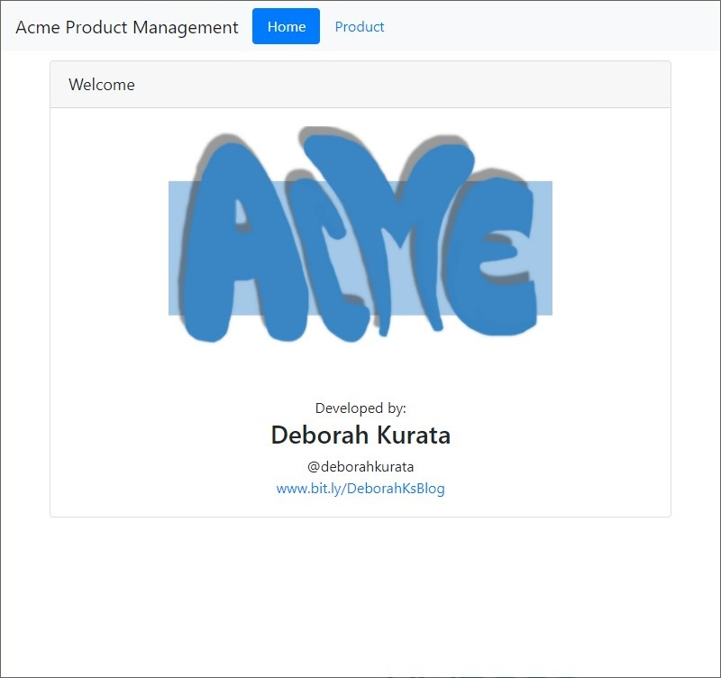
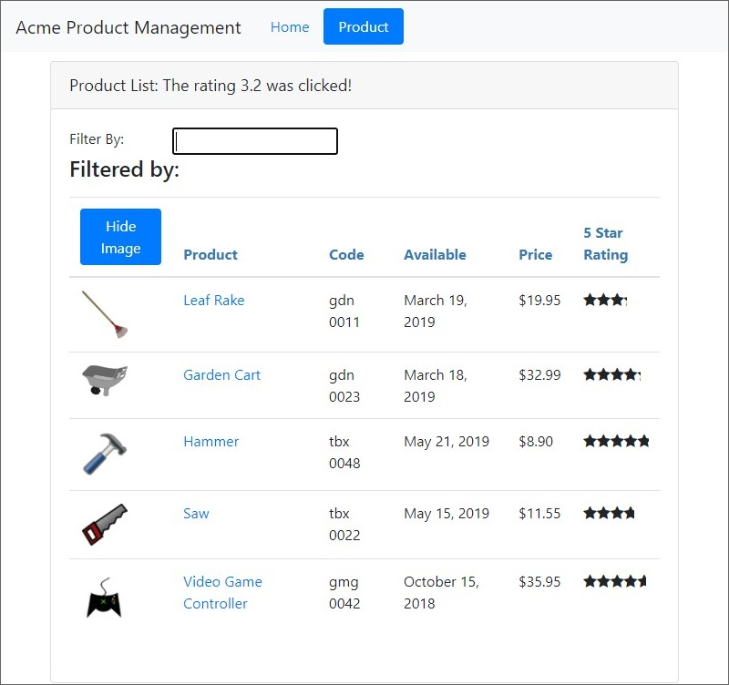

# Angular-training

This project was created by Deborah Kurata and it is currently under Pluralsight list of coueses for [Angular learning path.](https://www.pluralsight.com/courses/angular-2-getting-started-update)

## Topics learned in this course
* Introduction to Components
* Templates, Interpolation and Directives
* Data Binding & Pipes
* Complement for Component topic
* Building Nested Components
* Services and Dependency Injection
* Retrieving Data Using HTTP
* Navigation and Routing basics
* Navigation and Routing Additional Techniques
* Angular Modules
* Building, Testing and Deploying with the CLI

# Screenshot

